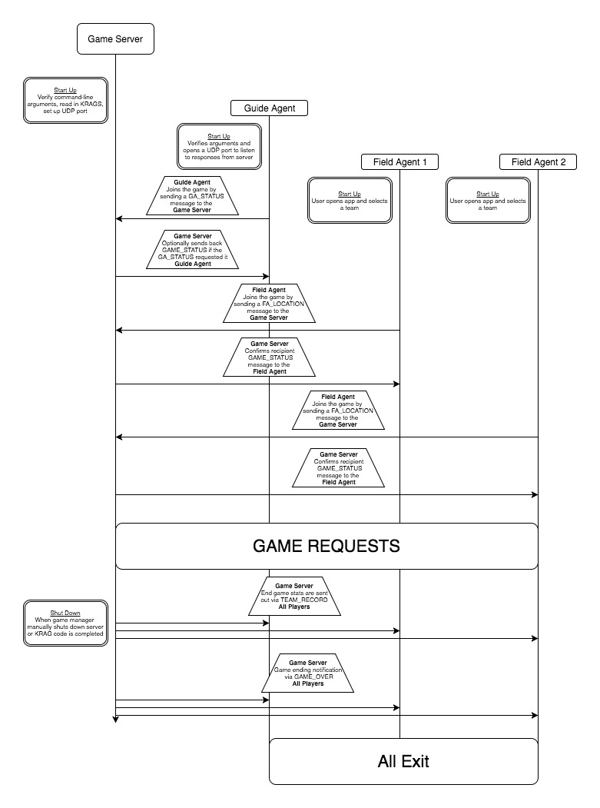
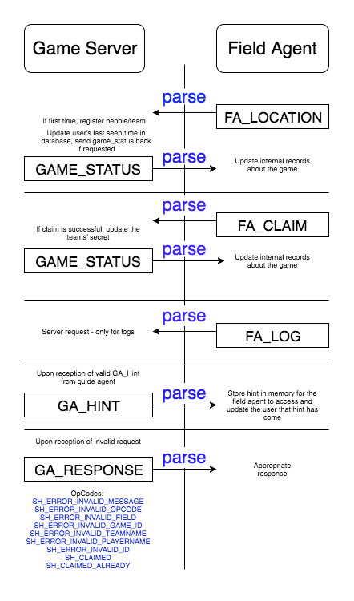
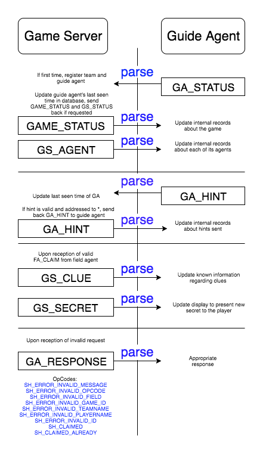
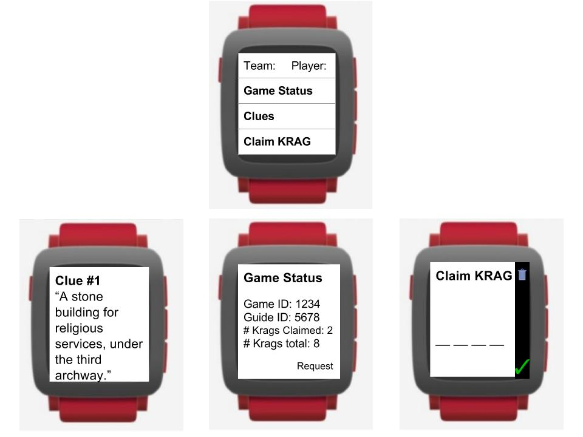

# CS50 - OPERATION K. R. A. G.

Operatives: Andy "Ders" Bando-Hess, Linda "Just-put-linda-xiao" Xiao, Edward "🐙" Yao

Team: 1puorG

## Design Document 

The full requirements spec for this project is available at [Dartmouth CS50 Krag Requirements](http://www.cs.dartmouth.edu/~cs50/Labs/Project/REQUIREMENTS.html). This document will focus on the design decisions that our group makes in order to implement the project.

### Overall Data Flow 





### Game Server - 🐙
------


#### User Interface 


To run the game server, the following command 

```./gameserver gameId=... kff=... port=...```


* `gameId` provides the hexadecimal ID number of this game;
* `kff` provides the path to the krag file, which contains coordinates and clues for each krag;
* `port` provides the port number of the Game Server.

The actions made by the server will print to stdout and errors will print to stderr. Other than this interaction, the only control that the game manager will be able to assert is to end the server.

**Example output**


##### Inputs and Outputs

Reads a list of KRAGS (lines) from a file in the following format:

``` latitude=|longitude=|kragId=|clue= ```

where `latitude` and `longitude` are both decimal numbers that can be read into a floating-point variable, `kragId` is a 4-digit hex code, and clue is the text providing a clue for locating the krag (max length 140 chars).

#### Functional Decomposition into Modules

We anticipate the following modules or functions:

1. *main* - parses the arguments and initializes other modules
2. *message* - verifies and opens sockets for network communication and parses incoming and outgoing messages, will also be used by guide agent
3. *parsing* - parses and validates messages 
4. *handling* - handles incoming messages and sends the request to appropriate handler functions

#### Pseudo code for logic/algorithmic flow

The game server runs as follows:

1. Game master launches the server and the server applications parses the arguments
2. If valid, reads in KRAGS from data file and inserts them into the hashtable, and each key id gets inserted into an array of KRAGids
3. Open up a DGRAM (UDP) at the address specified on the command line and listen for requests - a full list of opcodes can be found on the [required spec](http://www.cs.dartmouth.edu/~cs50/Labs/Project/REQUIREMENTS.html#opcodes)
    4. REQ - When a guide agent connects with a `GA_STATUS`, form a new struct for a team internally and send back a game_status
    5. REQ - When a field agent asks for list of teams, send back `GAME_STATUS`
    6. REQ - When a field agent asks for status update with `FA_LOCATION`, send back `STATUS_UPDATE`
    7. REQ - guide agent sends status update with `GA_STATUS`, send back `GS_STATUS` if the guide agent requested it
    8. REQ - When a field agent enters a hex code `FA_CLAIM`, send back success if code was right (and has not already been claimed), fail otherwise. If code is valid, send field agent two random clues `GS_CLUE` from two random KRAGs to the guide agent on the same team, and updated passcode `GS_SECRET` to the guide agent. 
    9. REQ - Guide agent sends a message hint `GA_HINT` to a target field agent on their team to the server, server forwards it to the specified field agent
10. Game ends whe all krags have been claimed or server is manually ended, send out `GAME_OVER` to all agents

#### Dataflow through modules

1. *main* - parses the arguments and initializes other modules, passing up the korrect krags 
2. *message* - verifies and opens sockets for network communication and parses incoming and outgoing messages, will also be used by guide agent 
3. *parsing* - parses and validates messages 
4. *handling* - handles incoming messages and sends the request to appropriate handler functions

#### Major Data Structures
1. *hashtable* - for storage and searching of KRAGs, keyed and hashed (jenkin's good old hash) on KRAGid, each item is a struct 
2. *set* - for storage of the teams, each a struct containing teamId and teamMembers
3. a struct of *teams* representing each team - each has a field for a guide_agent, an array of field agents, an array of unseen KRAGids, number of claimed Krags

##### Testing plan
1. Unit testing via hard-coded messages like a guide agent joining the server or field agent requesting a status update and verify if response is valid
2. Integration testing via a sequence of commands that correspond to gameplay


### Guide Agent - "ders"
------

#### User Interface 


To run the game agent, the following command 
```./guideagent guideId=... team=... player=... host=... port=...```
* `guideId` provides the hexadecimal ID number for this player
* `team` provides the name of the team to which the agent belongs
* `player` provides the name of the guide agent
* `host` provides the host name of the Game Server (e.g., `flume.cs.dartmouth.edu`)
* `port` provides the port number of the Game Server

stdin/stdout terminal console
If time, ncurses GUI
* see the current game statistics;
* see the current location and status of each player on Guide’s team;
* see the current secret string;
* see a list of known clues.

Every 15 seconds, locations are updated in GUI
* In console, coordinate strings
* In map, locations are shown as dots

##### Inputs and Outputs
**Inputs**: the inputs are the arguments given in the command: guideId, team, player, host, and port. 

At initialization, get secret code (letters are left as blanks).

#### Functional Decomposition into Modules
1. *main* - parses the arguments and initializes other modules
2. *message* - verifies and opens sockets for network communication and parses incoming and outgoing messages, will also be used by game server
3. *parsing* - parses and validates messages 
4. *handling* - handles incoming messages and sends the request to appropriate handler functions

#### Pseudo code for logic/algorithmic flow
1. Join the game and creates a DGRAM (UDP) socket, sending a `GA_STATUS` message to announce its presence to the Game Server at the server’s host/port address. 
2. While game is not over
	3. When a Field Agent becomes ‘active’, receives information for Field Agent from Game Server (field agent name, location, etc). 
	4. Periodically sends a `GA_STATUS` message to the Game Server, and (when desired) requests a `GS_STATUS` response from the Game Server.
	5. After Field Agent successfully claims a KRAG, receive clues about the location of up to two krags;
		6. Choose which Field Agent to send the additional clue: `GA_HINT`
		7. Stores active clues in array
	8. receive updates about the hacker’s secret from Game Server in `GS_SECRET` message
	9. receive updates about game status, from Gave Server/Field Agent
		10. Updates FA’s information
		11. Updates internal records about state of game
12. When `GAME_OVER` message is sent, Guide Agent should then exit.

#### Dataflow through modules
1. *main* - parses the arguments and initializes other modules
2. *message* - verifies and opens sockets for network communication and parses incoming and outgoing messages, will also be used by guide agent
3. *parsing* - parses and validates messages 
4. *handling* - handles incoming messages and sends the request to appropriate handler functions

#### Major Data Structures
1. *set* of players with key of player name and item of player struct. 
2. *player_t* contains player name, latitude, longitude, pebbleId, lastContact
3. array of current clues not yet solved.
4. String representing secret code.
5. *status* - gameId, guideId, numClaimed, numKrags

##### Testing plan
1. Unit testing via hard-coded messages like a guide agent joining the server or field agent requesting a status update and verify if response is valid
2. Integration testing via a sequence of commands that correspond to gameplay

 
  
### Field Agent - "Just-put-linda-xiao"
------

#### User Interface
To run the pebble, open the app. 

At opening of app, 
* Choose from a preconfigured list of team names, goes to next screen
* Choose from a preconfigured list of player names

Table of contents:
1. Current hints
	1. CLUE: Prints line of text onto screen 
2. Last game status
	1. Consists of gameId, guideId, numClaimed, numKrags
	2. Also a request button
		3. Sends `FA_LOCATION` with `statusReq` of 1
3. hexID input screen
	1. Inputted using voice?
	2. If not, then number and letter list

Notifications:
1. Arrival of new hint
2. Game status update



#### Inputs and Outputs
**Inputs** team name and player name. 

#### Functional Decomposition into Modules
1. *main* - parses the arguments and initializes other modules
2. *parsing* - parses and validates messages 
3. *handling* - handles incoming messages and sends the request to appropriate handler functions

#### Pseudo code for logic/algorithmic flow
1. Open app in pebble, prompted to choose from list of team names. 
	2. If team name has not been chosen yet, creates a new team.
3. Prompted with choosing from list of player names. 
	4. Remove player name from list, so two players don’t have same name.
5. While game is in progress & team has guide agent.
	6. Every 15 seconds, sends `FA_LOCATION` messages to game server, and when desired, requests a game-status response from the Game Server.
	7. Receives `GA_HINT` from game server.
		8. Validate message fields and store hint in memory for display.
	9. On occasion, sends the krag code via `FA_CLAIM` to the game server.
		10. Receives a `SH_CLAIMED` response if success
		11. `SH_CLAIMED_ALREADY` response to indicate failure
	12. Can send `FA_LOG` messages to get information into log files.
13. When game ends, receives `GAME_OVER` message.

#### Dataflow through modules
1. *main* - parses the arguments and initializes other modules
2. *parsing* - parses and validates messages 
3. *handling* - handles incoming messages and sends the request to appropriate handler functions

#### Major Data Structures
1. Array of clues. 
2. *status* - gameId, guideId, numClaimed, numKrags

##### Testing plan
1. Unit testing via hard-coded messages like a guide agent joining the server or field agent requesting a status update and verify if response is valid
2. Integration testing via a sequence of commands that correspond to gameplay